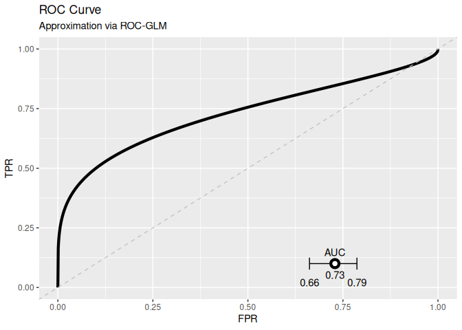
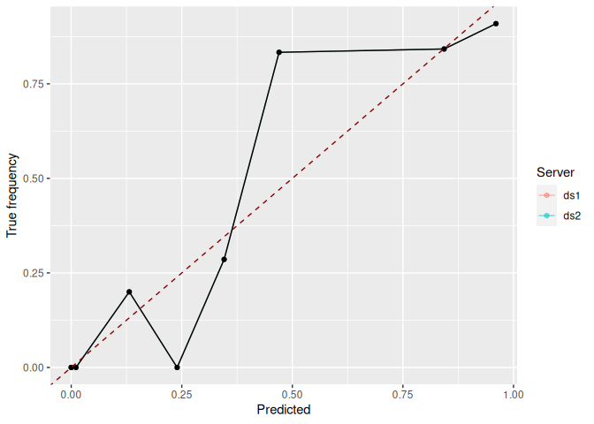

<!-- README.md is generated from README.Rmd. Please edit that file -->

[](https://github.com/difuture-lmu/dsBinVal/actions/workflows/R-CMD-check.yaml)
[](https://www.gnu.org/licenses/lgpl-3.0)
[](https://codecov.io/gh/difuture-lmu/dsBinVal)

# ROC-GLM and Calibration for DataSHIELD

The package provides functionality to conduct and visualize ROC analysis
and calibration on decentralized data. The basis is the
[DataSHIELD](https://www.datashield.org/) infrastructure for distributed
computing. This package provides the calculation of the
[**ROC-GLM**](https://www.jstor.org/stable/2676973?seq=1) with [**AUC
confidence intervals**](https://www.jstor.org/stable/2531595?seq=1) as
well as calibration curves and the brier score. In order to calculate
the ROC-GLM or assess calibration it is necessary to push models and
predict them at the servers which is also provided by this package. Note
that DataSHIELD uses [privacy
filter](https://data2knowledge.atlassian.net/wiki/spaces/DSDEV/pages/714768398/Disclosure+control)
from DataSHIELD v5 onwards that are also used in this package.
Additionally, this package uses the old option `datashield.privacyLevel`
(to indicate the minimal amount of values required to allow sharing an
aggregation) as fallback. Instead of setting the option, we directly
retrieve the fallback privacy level from the
[`DESCRIPTION`](https://github.com/difuture-lmu/dsBinVal/blob/master/DESCRIPTION)
file each time a function calls for it. This options is set to 5 by
default. The methodological base of the package is explained in detail
[here](https://arxiv.org/abs/2203.10828).

## Installation

At the moment, there is no CRAN version available. Install the
development version from GitHub:

``` r
remotes::install_github("difuture-lmu/dsBinVal")
```

#### Register methods

It is necessary to register the assign and aggregate methods in the OPAL
administration. These methods are registered automatically when
publishing the package on OPAL (see
[`DESCRIPTION`](https://github.com/difuture-lmu/dsBinVal/blob/main/DESCRIPTION)).

Note that the package needs to be installed at both locations, the
server and the analysts machine.

## Installation on DataSHIELD

The two options are to use the Opal API:

  - Log into Opal ans switch to the `Administration/DataSHIELD/` tab
  - Click the `Add DataSHIELD package` button
  - Select `GitHub` as source, and use `difuture-lmu` as user,
    `dsBinVal` as name, and `main` as Git reference.

The second option is to use the `opalr` package to install `dsBinVal`
directly from `R`:

``` r
### User credentials (here from the opal test server):
surl     = "https://opal-demo.obiba.org/"
username = "administrator"
password = "password"

### Install package and publish methods:
opal = opalr::opal.login(username = username, password = password, url = surl)

opalr::dsadmin.install_github_package(opal = opal, pkg = "dsBinVal", username = "difuture-lmu", ref = "main")
opalr::dsadmin.publish_package(opal = opal, pkg = "dsBinVal")

opalr::opal.logout(opal)
```

## Usage

A more sophisticated example is available
[here](github.com/difuture-lmu/datashield-roc-glm-demo).

``` r
library(DSI)
#> Loading required package: progress
#> Loading required package: R6
library(DSOpal)
#> Loading required package: opalr
#> Loading required package: httr
library(dsBaseClient)

library(dsBinVal)
```

#### Log into DataSHIELD server

``` r
builder = newDSLoginBuilder()

surl     = "https://opal-demo.obiba.org/"
username = "administrator"
password = "password"

builder$append(
  server   = "ds1",
  url      = surl,
  user     = username,
  password = password,
  table    = "CNSIM.CNSIM1"
)
builder$append(
  server   = "ds2",
  url      = surl,
  user     = username,
  password = password,
  table    = "CNSIM.CNSIM2"
)
builder$append(
  server   = "ds3",
  url      = surl,
  user     = username,
  password = password,
  table    = "CNSIM.CNSIM3"
)

connections = datashield.login(logins = builder$build(), assign = TRUE)
#> 
#> Logging into the collaborating servers
#> 
#>   No variables have been specified. 
#>   All the variables in the table 
#>   (the whole dataset) will be assigned to R!
#> 
#> Assigning table data...
```

#### Load test model, push to DataSHIELD, and calculate predictions

``` r
# Load the model fitted locally on CNSIM:
load(here::here("Readme_files/mod.rda"))
# Model was calculated by:
#> glm(DIS_DIAB ~ ., data = CNSIM, family = binomial())

# Push the model to the DataSHIELD servers:
pushObject(connections, mod)
#> [2023-01-09 13:20:03] Your object is bigger than 1 MB (5.75186157226562 MB). Uploading larger objects may take some time.

# Create a clean data set without NAs:
ds.completeCases("D", newobj = "D_complete")
#> $is.object.created
#> [1] "A data object <D_complete> has been created in all specified data sources"
#> 
#> $validity.check
#> [1] "<D_complete> appears valid in all sources"

# Calculate scores and save at the servers:
pfun =  "predict(mod, newdata = D, type = 'response')"
predictModel(connections, mod, "pred", "D_complete", predict_fun = pfun)

datashield.symbols(connections)
#> $ds1
#> [1] "D"          "D_complete" "mod"        "pred"      
#> 
#> $ds2
#> [1] "D"          "D_complete" "mod"        "pred"      
#> 
#> $ds3
#> [1] "D"          "D_complete" "mod"        "pred"
```

#### Calculate l2-sensitivity

``` r
# In order to securely calculate the ROC-GLM, we have to assess the
# l2-sensitivity to set the privacy parameters of differential
# privacy adequately:
l2s = dsL2Sens(connections, "D_complete", "pred")
l2s
#> [1] 0.001475989

# Due to the results presented in https://arxiv.org/abs/2203.10828, we set the privacy parameters to
# - epsilon = 0.2, delta = 0.1 if        l2s <= 0.01
# - epsilon = 0.3, delta = 0.4 if 0.01 < l2s <= 0.03
# - epsilon = 0.5, delta = 0.3 if 0.03 < l2s <= 0.05
# - epsilon = 0.5, delta = 0.5 if 0.05 < l2s <= 0.07
# - epsilon = 0.5, delta = 0.5 if 0.07 < l2s BUT results may be not good!
```

#### Calculate ROC-GLM

``` r
# The response must be encoded as integer/numeric vector:
ds.asInteger("D_complete$DIS_DIAB", "truth")
#> $is.object.created
#> [1] "A data object <truth> has been created in all specified data sources"
#> 
#> $validity.check
#> [1] "<truth> appears valid in all sources"
roc_glm = dsROCGLM(connections, truth_name = "truth", pred_name = "pred",
  dat_name = "D_complete", seed_object = "pred")
#> 
#> [2023-01-09 13:22:12] L2 sensitivity is: 0.0015
#> 
#> [2023-01-09 13:22:13] Setting: epsilon = 0.2 and delta = 0.1
#> 
#> [2023-01-09 13:22:13] Initializing ROC-GLM
#> 
#> [2023-01-09 13:22:13] Host: Received scores of negative response
#> [2023-01-09 13:22:13] Receiving negative scores
#> [2023-01-09 13:22:15] Host: Pushing pooled scores
#> [2023-01-09 13:22:17] Server: Calculating placement values and parts for ROC-GLM
#> [2023-01-09 13:22:18] Server: Calculating probit regression to obtain ROC-GLM
#> [2023-01-09 13:22:20] Deviance of iter1=38.8162
#> [2023-01-09 13:22:21] Deviance of iter2=48.9408
#> [2023-01-09 13:22:22] Deviance of iter3=52.5077
#> [2023-01-09 13:22:24] Deviance of iter4=52.5684
#> [2023-01-09 13:22:25] Deviance of iter5=52.5684
#> [2023-01-09 13:22:26] Deviance of iter6=52.5684
#> [2023-01-09 13:22:26] Host: Finished calculating ROC-GLM
#> [2023-01-09 13:22:26] Host: Cleaning data on server
#> [2023-01-09 13:22:27] Host: Calculating AUC and CI
#> [2023-01-09 13:22:39] Finished!
roc_glm
#> 
#> ROC-GLM after Pepe:
#> 
#>  Binormal form: pnorm(0.69 + 0.54*qnorm(t))
#> 
#>  AUC and 0.95 CI: [0.66----0.73----0.79]

plot(roc_glm)
```

<!-- -->

#### Assess calibration

``` r
dsBrierScore(connections, "truth", "pred")
#> [1] 0.01190512

### Calculate and plot calibration curve:
cc = dsCalibrationCurve(connections, "truth", "pred")
cc
#> 
#> Calibration curve:
#> 
#>  Number of shared values:
#>            (0,0.1] (0.1,0.2] (0.2,0.3] (0.3,0.4] (0.4,0.5] (0.5,0.6] (0.6,0.7]
#> n             6791        44        16         9         5         2         7
#> not_shared       0         0         0         0         2         2         2
#>            (0.7,0.8] (0.8,0.9] (0.9,1]
#> n                  1         1       0
#> not_shared         1         1     NaN
#> 
#> Values of the calibration curve:
#>               (0,0.1] (0.1,0.2] (0.2,0.3] (0.3,0.4] (0.4,0.5] (0.5,0.6]
#> truth     0.009571492 0.2500000 0.3750000 0.2222222 0.4000000         0
#> predicted 0.010313664 0.1393237 0.2468129 0.3414045 0.2534424         0
#>           (0.6,0.7] (0.7,0.8] (0.8,0.9] (0.9,1]
#> truth     0.4285714         0         0     NaN
#> predicted 0.4537049         0         0     NaN
#> 
#> 
#> Missing values are indicated by the privacy level of 5.

plot(cc)
#> Warning: Removed 18 rows containing missing values (`geom_point()`).
#> Warning: Removed 18 rows containing missing values (`geom_line()`).
#> Warning: Removed 1 rows containing missing values (`geom_point()`).
#> Warning: Removed 1 row containing missing values (`geom_line()`).
```

<!-- -->

## Deploy information:

**Build by root (Darwin) on 2023-01-09 13:22:46.**

This readme is built automatically after each push to the repository.
Hence, it also is a test if the functionality of the package works also
on the DataSHIELD servers. We also test these functionality in
`tests/testthat/test_on_active_server.R`. The system information of the
local and remote servers are as followed:

  - Local machine:
      - `R` version: R version 4.2.2 (2022-10-31)
      - Version of DataSHELD client packages:

| Package      | Version |
| :----------- | :------ |
| DSI          | 1.5.0   |
| DSOpal       | 1.4.0   |
| dsBaseClient | 6.2.0   |
| dsBinVal     | 1.0.1   |

  - Remote DataSHIELD machines:
      - OPAL version of the test instance: 4.5.3
      - `R` version of ds1: R version 4.2.1 (2022-06-23)
      - `R` version of ds2: R version 4.2.1 (2022-06-23)
      - Version of server packages:

| Package   | ds1: Version | ds2: Version | ds3: Version |
| :-------- | :----------- | :----------- | :----------- |
| dsBase    | 6.2.0        | 6.2.0        | 6.2.0        |
| resourcer | 1.3.0        | 1.3.0        | 1.3.0        |
| dsBinVal  | 1.0.1        | 1.0.1        | 1.0.1        |
